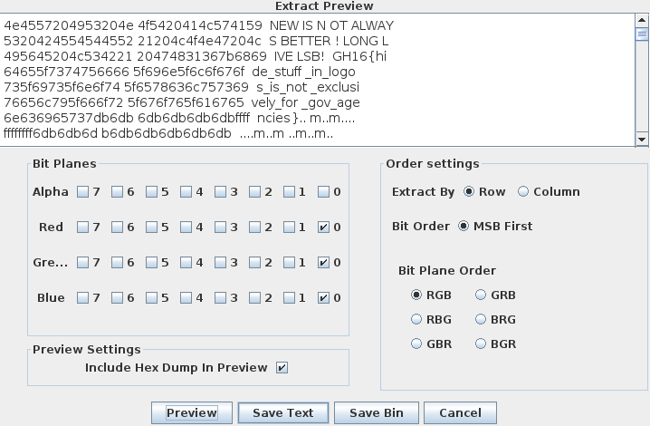

_[<<< Return to GreHack CTF 2016 tasks and writeups](https://github.com/nbrisset/CTF/tree/master/grehack-ctf-2016)_
# Did you take a look at our logo?

This was the second out of five steganography challenges:
the GreHack organization team hid a flag in [their logo](GH16_logo_txt_black.png).


```
root@blinils:~/GH16# file GH16_logo_txt_black.png
GH16_logo_txt_black.png: PNG image data, 3467 x 792, 8-bit/color RGBA, non-interlaced
```

If we examine the picture from every angle with StegSolve, one thing catches the eye:
there is some noise in the red, green and blue "0 bit" planes. This probably means that
there is hidden data in the LSB a.k.a. [Least Significant Bit](http://ijact.org/volume3issue4/IJ0340004.pdf),
a famous steganography technique.


Let's extract the data and.... taadaaam! By the way, this is a nice implied reference to the ANSSI logo challenge!

For those who, as me, enjoy challenges and treasure hunts,
hurry up and go read [Pierre Bienaimé's article](http://blog.bienaime.info/2015/01/le-challenge-du-logo-anssi.html) (MISC n°73).



We could also use zsteg, a powerful tool which finds in no time the hidden text in the LSB.

```
root@blinils:~/GH16# zsteg GH16_logo_txt_black.png | head -n1
b1,rgb,lsb,xy .. text: "NEW IS NOT ALWAYS BETTER! LONG LIVE LSB! GH16{hide_stuff_in_logos_is_not_exclusively_for_gov_agencies}"
```
