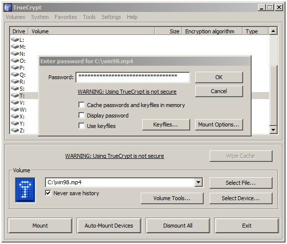

_[<<< Return to GreHack CTF 2016 tasks and writeups](https://github.com/nbrisset/CTF/tree/master/grehack-ctf-2016)_
# Windows 98

> Windows 98 could hide many things :)

> sha1sum : 6f924b4fb2500ffaf41b7fcc5f4ed86718987de5

This was the first out of three forensic challenges:
we had to find a flag in a [tarball file](1479483212.99_win98.tar.gz).

First of all, we checked the file's type and its SHA-1 digest, then we extracted the files and checked their type too.

```
root@blinils:~/GH16# sha1sum 1479483212.99_win98.tar.gz
6f924b4fb2500ffaf41b7fcc5f4ed86718987de5  1479483212.99_win98.tar.gz

root@blinils:~/GH16# file 1479483212.99_win98.tar.gz
1479483212.99_win98.tar.gz: gzip compressed data, last modified: Mon Nov 14 12:36:06 2016, from Unix

root@blinils:~/GH16# tar -zxf 1479483212.99_win98.tar.gz && ls
1479483212.99_win98.tar.gz  win98.jpg  win98.mp4

root@blinils:~/GH16# file w*
win98.jpg: JPEG image data, JFIF standard 1.01, resolution (DPI),
density 72x72, segment length 16, comment: "", baseline, precision 8, 640x512, frames 3

win98.mp4: ISO Media, MP4 v2 [ISO 14496-14]
```

+ [win98.jpg](win98.jpg) shows a [fatal exception error](https://en.wikipedia.org/wiki/Fatal_exception_error)
of MS Windows, which involves a [blue screen of death](https://fr.wikipedia.org/wiki/%C3%89cran_bleu_de_la_mort).
+ [win98.mp4](win98.mp4) shows a press demonstration with Bill Gates, following the release of Windows 98.

Quoting the article [Windows 98](https://en.wikipedia.org/w/index.php?title=Windows_98&oldid=756670860) from Wikipedia:

```
The release of Windows 98 was preceded by a notable press demonstration at COMDEX in April, 1998.
Microsoft CEO Bill Gates was highlighting the operating system's ease of use and enhanced support for
Plug and Play (PnP). However, when presentation assistant Chris Capossela hot plugged a USB scanner in,
the operating system crashed, displaying a Blue Screen of Death. Gates remarked after derisive applause
and cheering from the audience, "That must be why we're not shipping Windows 98 yet." Video footage of
this event became a popular Internet phenomenon.
```

Is there any hidden data? Let's use "binwalk", a tool designed to analyze and extract data contained in a file.

```
root@blinils:~/GH16# binwalk win98.jpg

DECIMAL       HEXADECIMAL     DESCRIPTION
--------------------------------------------------------------------------------
25            0x19            PDF document, version: "1.5"
225           0xE1            Copyright string: "Copyright Flag"
856           0x358           JPEG image data, JFIF standard 1.02
55519         0xD8DF          PDF document, version: "1.4"
55590         0xD926          Zlib compressed data, default compression
57635         0xE123          Unix path: /S/Transparency/CS/DeviceRGB/K true>>
57714         0xE172          Zlib compressed data, default compression
57863         0xE207          Zlib compressed data, default compression
63495         0xF807          Unix path: /Type/FontDescriptor/FontName/CAAAAA+LiberationSerif-Italic
63741         0xF8FD          Zlib compressed data, default compression
64044         0xFA2C          Unix path: /Type/Font/Subtype/TrueType/BaseFont/CAAAAA+LiberationSerif-Italic
64314         0xFB3A          Zlib compressed data, default compression
81149         0x13CFD         Unix path: /Type/FontDescriptor/FontName/BAAAAA+LiberationSerif
81386         0x13DEA         Zlib compressed data, default compression
81902         0x13FEE         Unix path: /Type/Font/Subtype/TrueType/BaseFont/BAAAAA+LiberationSerif
82419         0x141F3         Unix path: /PDF/Text/ImageC/ImageI/ImageB]
82542         0x1426E         Unix path: /S/Transparency/CS/DeviceRGB/I true>>/Contents 2 0 R>>
83895         0x147B7         JPEG image data, JFIF standard 1.01
```

Yeah, we found something: 
a [JPEG image](jpgwin98.jpg) and a [PDF document](pdfwin98.pdf) are in the original JPG!

Let's extract these new files from the offsets 55519 and 83895, with the "dd" command.

```
root@blinils:~/GH16# dd skip=55519 if=./win98.jpg of=./pdfwin98.pdf bs=1
33925+0 records in
33925+0 records out
33925 bytes (34 kB, 33 KiB) copied, 0,106929 s, 317 kB/s

root@blinils:~/GH16# dd skip=83895 if=./win98.jpg of=./jpgwin98.jpg bs=1
5549+0 records in
5549+0 records out
5549 bytes (5,5 kB, 5,4 KiB) copied, 0,0179559 s, 309 kB/s

root@blinils:~/GH16# file j* p*
jpgwin98.jpg: JPEG image data, JFIF standard 1.01, resolution (DPCM), density 28x28, segment length 16, baseline, precision 8, 128x128, frames 3
pdfwin98.pdf: PDF document, version 1.4

root@blinils:~/GH16# feh jpgwin98.jpg

root@blinils:~/GH16# xpdf pdfwin98.pdf
```


It should be noted that win98.jpg is a [polyglot](https://en.wikipedia.org/wiki/Polyglot_%28computing%29) file!
You should test it yourself, with `feh win98.jpg` and `xpdf win98.jpg`
[Ange Albertini](https://code.google.com/archive/p/corkami/) spoke about
[binary polyglots and weird binary file formats](https://www.sstic.org/2013/presentation/polyglottes_binaires_et_implications/)
during the 2013 edition of SSTIC, please have a look at his presentation!

The jpgwin98.jpg file only showed the logo of [TrueCrypt](https://en.wikipedia.org/wiki/TrueCrypt), a software which
can create a virtual encrypted disk within a file.

But what is the relationship between TrueCrypt and this challenge?

... wait a second.

What if win98.mp4 is also a polyglot file, being at once a video file and an encrypted disk?

Once TrueCrypt is downloaded and ready for use, we tried to open win98.mp4 as a disk, with the key found earlier.



Gotcha! We got a flag.txt file in it: GH16{Polyglotte_and_Windows98_Is_Fun}
