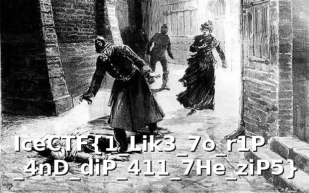

# R.I.P Transmission (Forensics, 65 points)
>[This](https://play.icec.tf/problem-static/rip_2067f9686b4d07eea2cac19b9c6588b2abac16500135901ce8781e4ccc262446)
seems to be receiving some sort of transmission. Our experts have been working around the clock trying and figure out
what the hell it means with no hope of getting to the bottom of it. You're our only hope.

We are given a link to a file which name is "rip_2067f9686b4d07eea-cut-4ccc262446"

First of all, and as usual, let's see what kind of stegano we have to deal with here.

```
root@blinils:~/ICECTF# mv rip_2067f9686b4d07eea2cac19b9c6588b2abac16500135901ce8781e4ccc262446 rip

root@blinils:~/ICECTF# file rip
rip: ELF 32-bit LSB executable, Intel 80386, version 1 (GNU/Linux), statically linked,
for GNU/Linux 2.6.32, BuildID[sha1]=9fd51896db8e1b47260951e8f6ca7d6023ce9ae6, not stripped
```

This is obviously a real executable file. But is there hidden data in it?

Let's use "hachoir-subfile", a tool designed to analyze and extract data contained in a file.

```
root@blinils:~/ICECTF# hachoir-subfile rip
[+] Start search on 1698648 bytes (1.6 MB)
[+] File at 0: ELF Unix/BSD program/library: 32 bits
[+] File at 1097008: ELF Unix/BSD program/library: 32 bits
[+] File at 1097017: ELF Unix/BSD program/library: 32 bits
[+] File at 1323949 size=112379 (109.7 KB): ZIP archive
[+] End of search -- offset=1698648 (1.6 MB)
Total time: 235 ms -- global rate: 6.9 MB/sec
```

Phew! We will not have to disassemble executable files... for this time.

Instead, let's extract the hidden ZIP archive from the offset 1323949, with the "dd" comma-.....

...... Wait a minute... this write-up is barely the same as the [Banana Boy]
(https://github.com/nbrisset/CTF/tree/master/sctf-2016-q1/banana-boy-20) one... except if we use another tool.

```
root@blinils:~/ICECTF# foremost rip
Processing: rip
|foundat=rip.jpgUT
*|
```

The result has been stored in the "output" folder, let's have a look.

```
root@blinils:~/ICECTF# ls -al ./output/zip/
total 120
drwxr-xr-- 2 root root   4096 août  25 19:17 .
drwxr-xr-- 3 root root   4096 août  25 19:17 ..
-rw-r--r-- 1 root root 112380 août  25 19:17 00002585.zip
```

Once extracted from the ZIP archive, the file "rip.jpg" will give us the flag and 65 more points!

```
root@blinils:~/ICECTF# unzip 00002585.zip
Archive:  00002585.zip
[00002585.zip] rip.jpg password:
password incorrect--reenter:
password incorrect--reenter:
   skipping: rip.jpg                 incorrect password
```

Noooooooo, it's not over! This challenge is worth 65 points, unlike Banana Boy.

Some time ago, we already cracked a password, for the challenge PasswordPDF from the ABCTF event.

But this time, we are going to use fcrackzip, a tool dedicated to archive files (like pdfcrack for PDF files).
Yet I am using the same dictionary as PasswordPDF, the big one from Dirbuster, a tool designed to search for
directories and files names on web servers.

```
root@blinils:~/ICECTF# time fcrackzip -u -D -p '/usr/share/wordlists/dirb/big.txt' 00002585.zip
PASSWORD FOUND!!!!: pw == bunny
 
real        0m0.050s
user        0m0.012s
sys        0m0.000s
```

The password was found at lightning speed (kind of). We open the ZIP archive and... taadaaam!

```
root@blinils:~/ICECTF# unzip 00002585.zip
Archive:  00002585.zip
[00002585.zip] rip.jpg password:            (bunny)
  inflating: rip.jpg
 
root@blinils:~/ICECTF# file rip.jpg
rip.jpg: JPEG image data, JFIF standard 1.01, resolution (DPI),
density 72x72, segment length 16, progressive, precision 8, 620x388, frames 1
```



Solution: IceCTF{1_Lik3_7o_r1P_4nD_diP_411_7He_ziP5}
